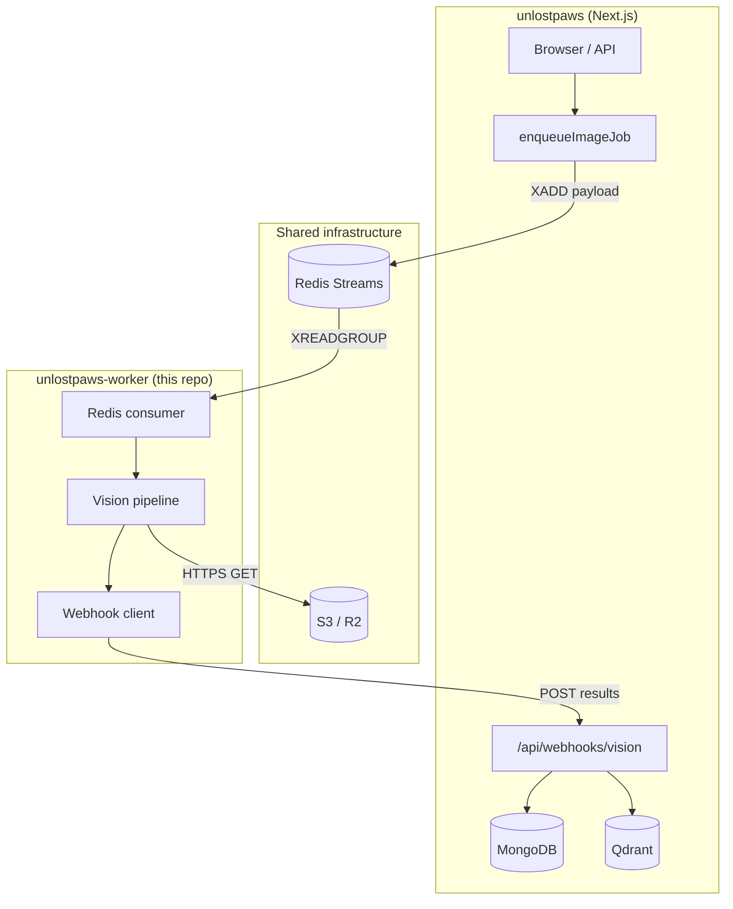
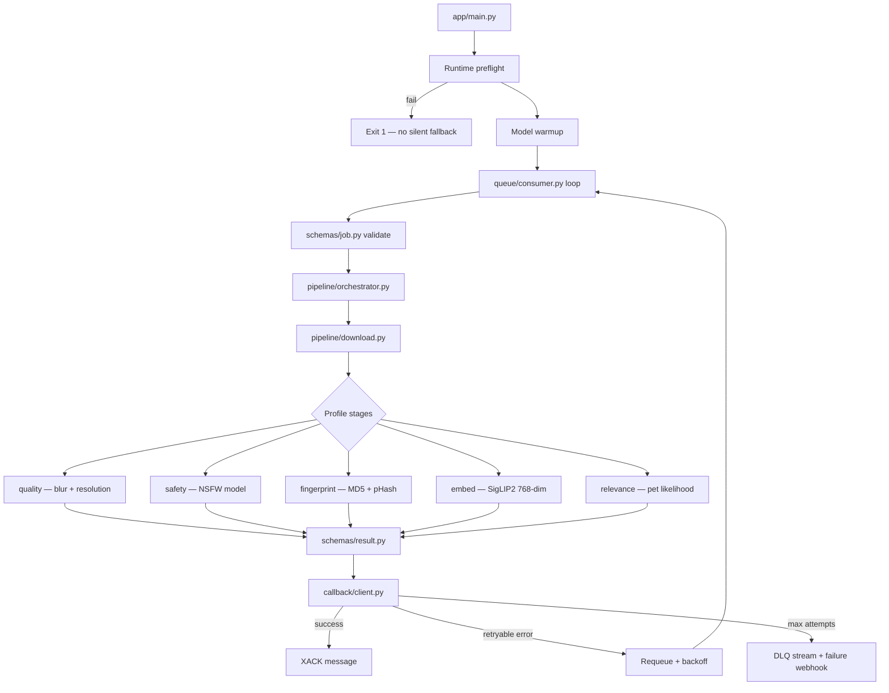

# UnLostPaws Vision Worker

[](https://www.python.org/)
[](https://www.gnu.org/licenses/agpl-3.0)
[](https://github.com/the-dot-squad/unlostpaws-worker/actions/workflows/ci.yml)

Background Async ML worker for **[UnLostPaws](https://github.com/the-dot-squad/unlostpaws)** — an open-source lost-and-found pet platform. This repo is **not** the website. It is the Python service that runs heavy vision inference off the request path, and POST results back via webhook.

When a user uploads pet photos on the site, the Next.js app enqueues a job on a **Redis Stream** (`unlostpaws:stream:vision-processing`). This worker pulls jobs with consumer groups, runs quality/safety/fingerprint/embed/relevance stages, and callbacks to `/api/webhooks/vision` so the app can approve listings, deduplicate abuse, and index SigLIP2 vectors in Qdrant.

---

## Architecture

### Platform context



### Worker internals



---

## Quick start

```bash
cp .env.example .env          # set REDIS_URL (rediss:// for Upstash TLS)
./tools/run doctor              # or: python -m tools doctor
docker compose up -d
```

| I have… | `VISION_PROFILE` | How to run |
| :--- | :--- | :--- |
| Dev laptop / Linux CPU | `cpu-quality` | `docker compose up -d` |
| ARM64 SBC / Graviton | `onnx-cpu-quality` | `docker compose up -d` |
| NVIDIA GPU | `gpu-standard` | `docker compose -f docker-compose.gpu.yml up -d` |
| Apple Silicon | `onnx-apple` | Native Python on macOS (not Docker) |
| Dedup only | `dedup-only` | Any CPU path |

**Docs:** [Guide](docs/GUIDE.md) · [Performance](docs/PERFORMANCE.md) · [ONNX export (maintainers)](docs/MODEL_EXPORT.md)

---

## Pipeline stages

Configured by **`VISION_PROFILE`** — not individual env toggles.

| Stage | Model / method |
| :--- | :--- |
| `quality` | Laplacian blur + resolution |
| `safety` | `Falconsai/nsfw_image_detection` |
| `fingerprint` | MD5 + pHash |
| `embed` | `google/siglip2-base-patch16-224` (768-dim) |
| `relevance` | SigLIP2 zero-shot pet check |

---

## Configuration

One knob: **`VISION_PROFILE`**. See [docs/GUIDE.md](docs/GUIDE.md) for tiers, env vars, and troubleshooting.

Required: `REDIS_URL`. GPU compose sets profile and device for you.

---

## Operator tools

Python implements all logic (`python -m tools`). For servers and cron, use the single bash entry point **`./tools/run`** — it picks `.venv/bin/python` when present and forwards args to the Python CLI.

```bash
./tools/run doctor                              # hardware detect + profile recommendation
./tools/run doctor --profile cpu-quality        # preflight only
./tools/run doctor --smoke --profile cpu-quality
./tools/run smoke --profile cpu-quality         # full pipeline test
./tools/run benchmark --profile cpu-quality --runs 5
./tools/run export --output output/onnx         # maintainers
```

Equivalent without bash:

```bash
python -m tools doctor
python -m tools smoke --profile cpu-quality
```

Bare metal worker process (Python 3.12):

```bash
python3.12 -m venv .venv && source .venv/bin/activate
pip install -e ".[dev]"
python app/main.py
```

---

## Job contract

**Enqueue** (Redis `XADD`, field `payload`) — produced by [unlostpaws `enqueueImageJob`](https://github.com/the-dot-squad/unlostpaws):

```json
{
  "jobType": "listing",
  "listingId": "listing_123",
  "imageUrls": ["https://example.com/pet.jpg"],
  "petType": "dog",
  "webhookUrl": "https://myapp.com/api/internal/ml-callback"
}
```

**Success callback** includes per-image `embedding`, `safety`, `relevance`, `quality`, `md5`, `phash`. **Failure** after max retries → DLQ + failure webhook.

Payload shapes are defined in `app/schemas/` and must stay compatible with the web app's webhook handler.

---

## Development

### Prerequisites

- **Python 3.12** (pinned in Docker; 3.13 works in CI; **3.14 is not supported** — torch/onnx wheels break)
- Redis reachable at `REDIS_URL` for integration tests that touch the broker (optional for unit tests)
- ~2 GB disk for Hugging Face model cache on first integration/smoke run

### Local setup

```bash
git clone https://github.com/the-dot-squad/unlostpaws-worker.git
cd unlostpaws-worker
python3.12 -m venv .venv
source .venv/bin/activate
pip install -e ".[dev]"
cp .env.example .env    # edit REDIS_URL if testing against a real broker
```

Run the worker locally (needs Redis + valid profile):

```bash
python app/main.py
```

Run against the full UnLostPaws stack: clone [unlostpaws](https://github.com/the-dot-squad/unlostpaws), start its Redis/Mongo/Qdrant dependencies, then point both `.env` files at the same `REDIS_URL` and matching `WEBHOOK_SECRET`.

### Testing

```bash
pytest                         # unit tests only (mocked ML) — same as CI
pytest -m integration -v       # slow; downloads + loads real models
pytest tests/unit/test_consumer.py -v   # single module
```

| Marker | What runs | When to use |
| :--- | :--- | :--- |
| default (`not integration`) | `tests/unit/` with mocked torch/onnx | Every PR; fast feedback |
| `integration` | `tests/integration/` — real warmup + pipeline | Before release; after model/profile changes |

Unit tests mock heavy deps in `tests/unit/conftest.py` so CI does not download SigLIP2 on every push.

### Lint & quality

```bash
ruff check app tests tools
ruff format app tests tools
aislop scan                    # AI-slop / style gate (target: clean run)
```

CI runs ruff + default pytest on Python 3.12 and 3.13 on every PR and `main` push. Docker images (CPU + GPU) are built and published to GHCR only when you push a `v*` tag (e.g. `v0.1.4`).

### Project conventions

When changing this repo, keep these rules in mind:

1. **Profile-first config** — stages, models, runtime, and precision come from `VISION_PROFILE` (`app/config/profiles.py`). Do not add per-stage env toggles; extend or adjust presets instead.
2. **Fail fast** — wrong hardware for a profile must exit at startup (`app/config/runtime_validation.py`), never silently fall back (e.g. GPU profile on a CPU image).
3. **Job boundary validation** — Redis payloads are parsed with `app/schemas/job.py` before the pipeline runs; keep schemas aligned with the Next.js enqueue + webhook handlers.
4. **Moderation-first pipeline** — cheap checks (quality, safety) run before embeddings (`app/pipeline/orchestrator.py`).
5. **Torch + ONNX parity** — new models need entries in `app/models/manifest.json`, factory wiring, and ONNX validation (`./tools/run export`, `./tools/run validate`).
6. **Operator UX** — commands live in `tools/` (Python); use `./tools/run` on servers when you need a single shell entry point.
7. **Docs** — deployment/profile detail belongs in `docs/GUIDE.md`; benchmarks in `docs/PERFORMANCE.md`; keep this README as overview + contributor entry.

### Making changes

| Change type | Touch |
| :--- | :--- |
| New / altered profile | `app/config/profiles.py`, `docs/GUIDE.md`, smoke/benchmark in CI or docs |
| New pipeline stage | `app/pipeline/stages/`, orchestrator, profiles, schemas, unit tests |
| New model backend | `app/models/`, `manifest.json`, factory, `tests/unit/test_factory.py` |
| Webhook payload field | `app/schemas/result.py` + coordinated change in **unlostpaws** webhook route |
| Docker / deploy | `Dockerfile`, `docker-compose*.yml`, `.env.example` |

Pull requests should include unit tests for logic changes. Run `./tools/run smoke --profile cpu-quality` (or `pytest -m integration`) when touching inference or profiles.

## License

This project is [AGPL-3.0](LICENSE). If you modify the worker and run it as a network service, you must make corresponding source available to users.
