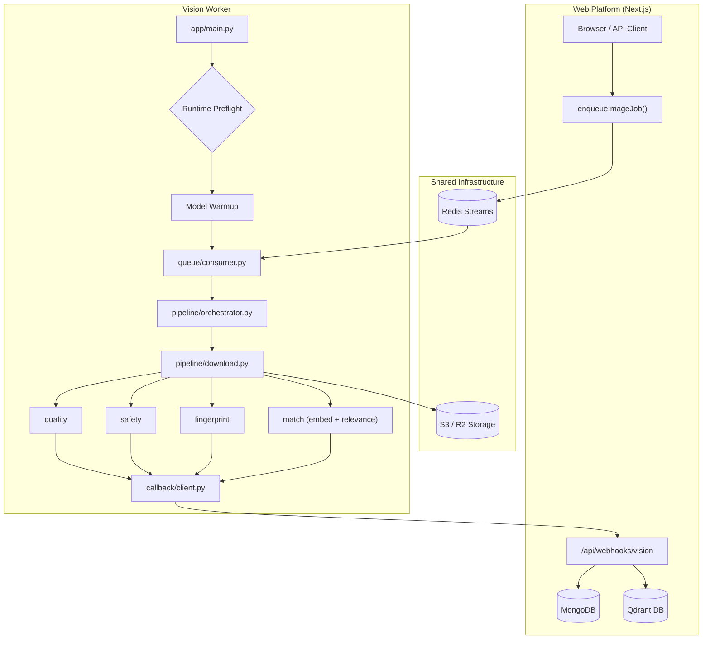

# UnLostPaws Vision Worker

[](https://www.python.org/)
[](https://www.gnu.org/licenses/agpl-3.0)
[](https://github.com/the-dot-squad/unlostpaws-worker/actions/workflows/ci.yml)

Background async ML worker for **[UnLostPaws](https://github.com/the-dot-squad/unlostpaws)** — an open-source lost-and-found pet platform. This repo is **not** the website. It is the Python service that runs heavy vision inference off the request path and POSTs results back via webhook.

When a user uploads pet photos, the Next.js app enqueues a job on a **Redis Stream** (`unlostpaws:stream:vision-processing`). This worker pulls jobs with consumer groups, runs quality / safety / fingerprint / match stages, and callbacks to `/api/webhooks/vision` so the app can approve listings, deduplicate abuse, and index SigLIP2 vectors in Qdrant.

---

## Architecture



---

## Quick start

```bash
cp .env.example .env          # set REDIS_URL (rediss:// for Upstash TLS)
./tools/run doctor              # hardware detect + profile resource hints
docker compose up -d
```

| I have… | Suggested env | How to run |
| :--- | :--- | :--- |
| Dev laptop / Linux CPU | `VISION_PROFILE=quality` `INFERENCE_RUNTIME=torch` `DEVICE=cpu` | `docker compose up -d` |
| ARM64 SBC / Graviton | `VISION_PROFILE=quality` `INFERENCE_RUNTIME=onnx` `ORT_EXECUTION_PROVIDER=cpu` | `docker compose up -d` |
| NVIDIA GPU | `VISION_PROFILE=quality` `DEVICE=cuda` | `docker compose -f docker-compose.gpu.yml up -d` |
| Apple Silicon | `VISION_PROFILE=quality` `ORT_EXECUTION_PROVIDER=coreml` | Native Python on macOS (CoreML not available in Linux Docker) |
| Hashing only | `VISION_PROFILE=dedup-only` | Any CPU path |

**Docs:** [Guide](docs/GUIDE.md) · [Performance](docs/PERFORMANCE.md) · [ONNX export (maintainers)](docs/MODEL_EXPORT.md)

---

## Profiles and models

Three capability tiers. Hardware (CPU / GPU / CoreML) is configured separately via env vars.

| Profile | SigLIP model | Embed dim | Relevance | Typical use |
| :--- | :--- | :--- | :--- | :--- |
| `dedup-only` | — | — | off | MD5 + pHash + quality only |
| `standard` | `siglip2-base-patch16-224` | 768 | on | Fast indexing, lower latency |
| `quality` | `siglip2-base-patch16-384` | 768 | on | Default production (higher resolution) |

Both ML profiles run the same fused pipeline on the full image:

**quality → safety → fingerprint → match** (SigLIP embed + relevance in one forward pass)

Default for new deploys: **`VISION_PROFILE=quality`**. Use **`standard`** when you want the fastest path with the same 768-d Qdrant vectors.

---

## Hardware and minimum requirements

| Profile | Min RAM | HF cache (first run) | GPU VRAM (optional) |
| :--- | :--- | :--- | :--- |
| `dedup-only` | 512 MB | negligible | — |
| `standard` | 3 GB | ~1 GB | 2 GB+ with `DEVICE=cuda` |
| `quality` | 4 GB | ~1.5 GB | 4 GB+ with `DEVICE=cuda` |

Also required:

- **Python 3.12** (pinned in Docker; 3.14+ not supported for torch/onnx wheels)
- **Redis** reachable at `REDIS_URL`
- **Apple Silicon CoreML** — run Python natively on macOS; CoreML is not available inside Linux Docker containers

Run `./tools/run doctor --profile quality` to print resource hints for your host.

---

## Configuration

| Variable | Purpose |
| :--- | :--- |
| `VISION_PROFILE` | `dedup-only` \| `standard` \| `quality` |
| `INFERENCE_RUNTIME` | `torch` (default) or `onnx` |
| `DEVICE` | Torch: `cpu` or `cuda` |
| `ORT_EXECUTION_PROVIDER` | ONNX: `cpu`, `cuda`, `tensorrt`, `coreml`, `openvino`, `qnn` |

Optional overrides: `MATCH_MODEL`, `SAFETY_MODEL`, `MODEL_PRECISION`, `BATCH_SIZE`.

Full env reference: [`.env.example`](.env.example) and [docs/GUIDE.md](docs/GUIDE.md).

---

## Job contract and optional `petType`

**Enqueue** (Redis `XADD`, field `payload`) — produced by [unlostpaws `enqueueImageJob`](https://github.com/the-dot-squad/unlostpaws):

```json
{
  "jobType": "listing",
  "listingId": "listing_123",
  "imageUrls": ["https://example.com/pet.jpg"],
  "petType": "dog",
  "webhookUrl": "https://myapp.com/api/internal/ml-callback"
}
```

### Optional `petType` hint

| | |
| :--- | :--- |
| **When to set** | The listing already knows the species (user selected it during upload) |
| **When to omit** | Zero-shot mode — omit the field or pass `""` |
| **Valid values** | `dog`, `cat`, `bird`, `rabbit`, `hamster`, `fish`, `reptile`, `horse`, `other` |
| **Unknown values** | Normalized to `""` at validation (graceful no-op) |

**What it does** (does not change the embedding):

1. Boosts `petLikelihood` scoring toward the hinted class when comparing pet vs distractor logits
2. Resolves `topLabel` to the hint when the model is uncertain between species (logit margin &lt; 0.75)
3. Does **not** force the label when the hint contradicts a strong model signal

Flow: `job.petType` → [`orchestrator.py`](app/pipeline/orchestrator.py) → [`match_stage`](app/pipeline/stages/match.py) → [`compute_relevance_from_logits`](app/models/relevance.py).

**Success callback** includes per-image `embedding`, `safety`, `relevance`, `quality`, `md5`, `phash`. **Failure** after max retries → DLQ + failure webhook.

Payload shapes live in `app/schemas/` and must stay compatible with the web app's webhook handler.

---

## Benchmark results

Evaluated on **305 images** (M4 Mac, torch CPU, zero-shot with `petType=""`). Reproduce:

```bash
python dev_benchmarks/download_test_images.py   # first time only
python dev_benchmarks/evaluate_workflow.py --profile standard
python dev_benchmarks/evaluate_workflow.py --profile quality
```

### Profile comparison (zero-shot)

| Profile | Pet relevance | Subclass match | Avg latency |
| :--- | :--- | :--- | :--- |
| `standard` (base @ 224px) | **86.6%** | 51.0% | **0.089s** |
| `quality` (base @ 384px) | **84.9%** | **64.1%** | 0.131s |

`quality` trades 1.7pp binary relevance for +13pp subclass accuracy and higher-res embeddings. See [docs/PERFORMANCE.md](docs/PERFORMANCE.md) for methodology.

### Effect of `petType` hints (standard profile)

When the correct species hint is provided, subclass match improves from **51.0% → 77.1%** on the same image set. Reproduce hint simulation:

```bash
python dev_benchmarks/simulate_hints.py
```

Relevance scoring uses a **0.30** likelihood threshold and **0.75** logit-margin fallback to `"other"` when uncertain. Algorithm details: [docs/GUIDE.md](docs/GUIDE.md#relevance-scoring).

CI smoke fixtures (`python -m tools eval`) use synthetic PNGs — not for accuracy measurement.

---

## Operator tools

Python implements all logic (`python -m tools`). On servers, use **`./tools/run`** — it picks `.venv/bin/python` when present.

```bash
./tools/run doctor --profile quality     # preflight + resource hints
./tools/run smoke --profile quality      # full pipeline test
./tools/run benchmark --profile quality --runs 5
./tools/run eval --profile quality       # CI smoke fixtures only
./tools/run export --output output/onnx  # maintainers
```

Equivalent without bash:

```bash
python -m tools doctor --profile quality
python -m tools smoke --profile standard
```

Bare metal worker (Python 3.12):

```bash
python3.12 -m venv .venv && source .venv/bin/activate
pip install -e ".[dev]"
python app/main.py
```

---

## Development

### Prerequisites

- Python 3.12, Redis at `REDIS_URL` for integration tests
- ~2 GB disk for Hugging Face model cache on first smoke/integration run

### Local setup

```bash
git clone https://github.com/the-dot-squad/unlostpaws-worker.git
cd unlostpaws-worker
python3.12 -m venv .venv && source .venv/bin/activate
pip install -e ".[dev]"
cp .env.example .env
python app/main.py
```

Run against the full UnLostPaws stack: clone [unlostpaws](https://github.com/the-dot-squad/unlostpaws), start Redis/Mongo/Qdrant, point both `.env` files at the same `REDIS_URL`.

### Testing

```bash
pytest                         # unit tests (mocked ML) — same as CI
pytest -m integration -v         # slow; real model warmup
pytest tests/unit/test_job_schema.py -v
```

| Marker | What runs | When |
| :--- | :--- | :--- |
| default | `tests/unit/` mocked | Every PR |
| `integration` | real warmup + pipeline | Before release |

### Local accuracy benchmarks

The gitignored `dev_benchmarks/` folder holds the 305-image eval set and reports. See [Benchmark results](#benchmark-results) above.

### Lint

```bash
ruff check app tests tools
ruff format app tests tools
```

CI runs ruff + unit pytest on Python 3.12. Docker images publish to GHCR on `v*` tags.

### Project conventions

1. **Profile-first config** — stages and models come from `VISION_PROFILE` ([`app/config/profiles.py`](app/config/profiles.py))
2. **Fail fast** — wrong hardware exits at startup ([`app/config/runtime_validation.py`](app/config/runtime_validation.py))
3. **Job boundary validation** — Redis payloads parsed with [`app/schemas/job.py`](app/schemas/job.py)
4. **Moderation-first** — quality and safety before embeddings ([`app/pipeline/orchestrator.py`](app/pipeline/orchestrator.py))
5. **Torch + ONNX parity** — new models need [`manifest.json`](app/models/manifest.json) + factory wiring

| Change type | Touch |
| :--- | :--- |
| Profile / model | `profiles.py`, `docs/GUIDE.md`, smoke/benchmark |
| Pipeline stage | `app/pipeline/stages/`, orchestrator, schemas, tests |
| Webhook field | `app/schemas/result.py` + coordinated change in **unlostpaws** |

Pull requests should include unit tests. Run `./tools/run smoke --profile quality` when touching inference.

---

## License

This project is [AGPL-3.0](LICENSE). If you modify the worker and run it as a network service, you must make corresponding source available to users.
