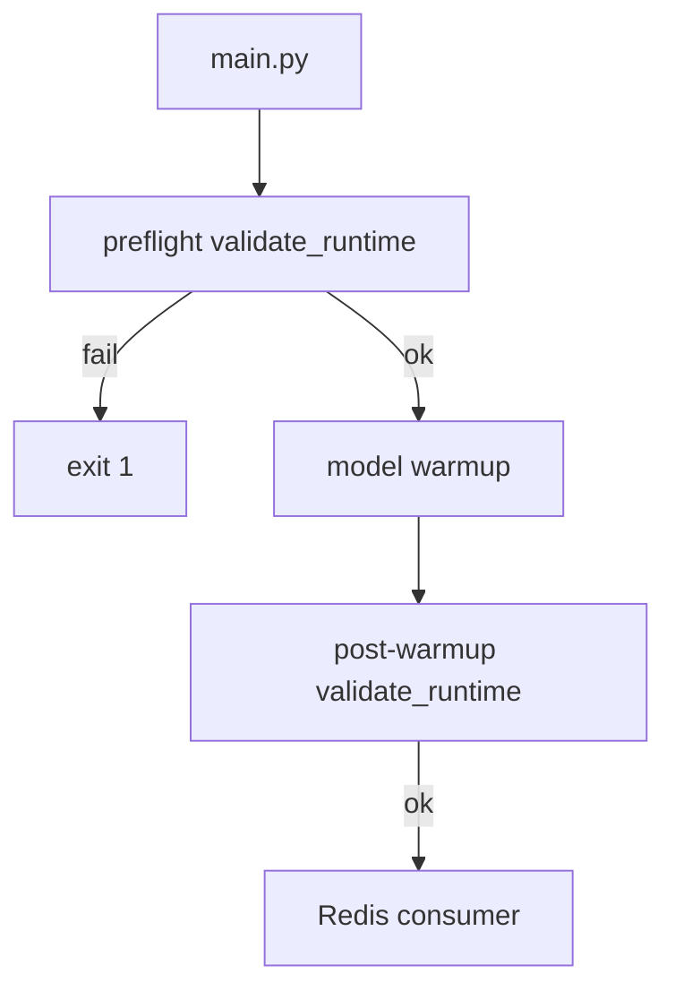

# Vision Worker Guide

How to deploy, configure profiles, and troubleshoot the UnLostPaws vision worker.

**Related:** [PERFORMANCE.md](PERFORMANCE.md) (benchmarks) · [MODEL_EXPORT.md](MODEL_EXPORT.md) (maintainer ONNX export)

---

## Concepts

| Term | Meaning |
| :--- | :--- |
| **Vision profile** (`VISION_PROFILE`) | One env var — stages, models, runtime, hardware |
| **Runtime** | `torch` (PyTorch) or `onnx` (ONNX Runtime) |
| **Execution provider** | ONNX hardware driver: CPU, CUDA, CoreML, … |
| **Pipeline stage** | `quality` → `safety` → `fingerprint` → `embed` → `relevance` |

Set **one** `VISION_PROFILE`. The worker validates hardware at startup and **exits** on mismatch (no silent GPU→CPU fallback).

---

## Quick start

```bash
cp .env.example .env          # edit REDIS_URL (use rediss:// for Upstash TLS)
./tools/run doctor                  # or: python -m tools doctor
docker compose up -d
python -m tools smoke --profile cpu-quality   # optional; downloads models first run
```

| Target | Command |
| :--- | :--- |
| CPU / dev | `docker compose up -d` |
| NVIDIA GPU | `docker compose -f docker-compose.gpu.yml up -d` |
| Apple Silicon | `python -m tools doctor` → run `python app/main.py` natively |

---

## Tier 1 — supported profiles (tested)

Use these unless you have a specific reason not to.

| Profile | Hardware | Compose | Notes |
| :--- | :--- | :--- | :--- |
| `cpu-quality` | x86/ARM CPU | `docker-compose.yml` | Default dev — full torch pipeline |
| `onnx-cpu-quality` | x86/ARM CPU | `docker-compose.yml` | INT8 ONNX; good for ARM SBCs |
| `gpu-standard` | NVIDIA CUDA | `docker-compose.gpu.yml` | Default production GPU |
| `onnx-apple` | Apple Silicon | Native macOS only | CoreML EP — not Linux Docker |
| `dedup-only` | Any CPU | Either | No ML — quality + fingerprint only |

---

## Tier 2 — advanced (supported, narrower use)

| Profile | When |
| :--- | :--- |
| `cpu-light` | NSFW only, no embeddings |
| `cpu-standard` | Embed + safety, no relevance |
| `onnx-cpu-standard` | ONNX variant of cpu-standard |
| `gpu-quality` | StrangerGuard safety on GPU |
| `onnx-gpu-standard` | ONNX FP16 on NVIDIA |
| `onnx-trt-standard` | TensorRT max throughput (+ `trt-cache` volume) |

---

## Tier 3 — experimental / special setup

Requires extra packages or hardware not in the default Docker images. Not in CI smoke matrix.

| Profile | Requirement |
| :--- | :--- |
| `onnx-intel` | `pip install onnxruntime-openvino` |
| `onnx-qualcomm` | Windows ARM64 + `onnxruntime-qnn` |
| `onnx-trt-quality`, `onnx-gpu-quality` | GPU image + StrangerGuard |

**Not supported:** Google Coral Edge TPU (models too large). Use `onnx-cpu-quality` on ARM64 instead.

Full preset list: [`app/config/profiles.py`](../app/config/profiles.py).

---

## Environment variables

| Variable | Required | Default | Description |
| :--- | :---: | :--- | :--- |
| `REDIS_URL` | Yes | — | Use `rediss://` for TLS (Upstash) |
| `VISION_PROFILE` | No | `cpu-quality` | Main config knob |
| `CONSUMER_NAME` | No | `worker-1` | Unique worker instance id |
| `MAX_JOB_ATTEMPTS` | No | `3` | Retries before DLQ |
| `HF_HOME` | No | auto | Model cache (auto per host) |

Stream keys, timeouts, and consumer group defaults are in [`.env.example`](../.env.example).

GPU compose bakes in `VISION_PROFILE=gpu-standard`, `DEVICE=cuda`, `WORKER_IMAGE_VARIANT=gpu`.

---

## Operator CLI

```bash
./tools/run doctor                         # detect hardware + recommend profile
./tools/run doctor --profile cpu-quality   # preflight only
./tools/run smoke --profile cpu-quality    # full pipeline test
./tools/run benchmark --profile cpu-quality --runs 5
./tools/run benchmark --all --output docs/benchmarks.json
```

Same commands via Python: `python -m tools <subcommand>`.

Maintainer / CI:

```bash
./tools/run export --output output/onnx
./tools/run validate --models-dir output/onnx
```

---

## Startup validation



Common fatal misconfigurations:

- `gpu-standard` on CPU Docker image → use `docker-compose.gpu.yml`
- `onnx-apple` inside Linux Docker → run natively on macOS
- CUDA profile without NVIDIA drivers / Container Toolkit

---

## Troubleshooting

| Symptom | Fix |
| :--- | :--- |
| Worker exits on start | `docker compose logs` + `python -m tools doctor` |
| Upstash connection failed | Use `rediss://` not `redis://` |
| Slow first job | Normal — models download on first warmup |
| INT8 relevance drift | `python -m tools validate` or use torch profile |

---

## Webhook metadata

Callbacks include runtime info for debugging:

```json
{
  "runtime": "onnx",
  "executionProvider": "CPUExecutionProvider",
  "modelPrecision": "int8"
}
```
